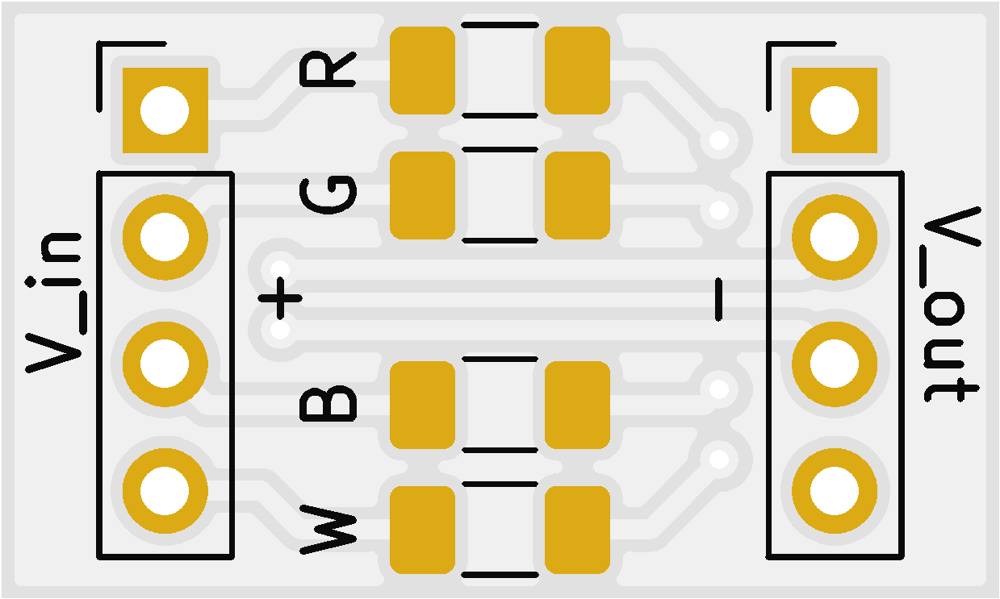
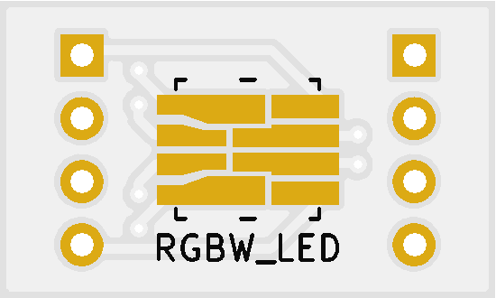

# RGBW LED module

This KiCad project describes a small PCB (12x20mm) that can accommodate a single high-power RGBW LED. Multiple such LEDs in parallel or series can be then used as light emitters in the bioreactor. 

&nbsp&nbsp

Some notes and considerations about the design:
 
 - The module uses four resistors to normalise the current flow through each LED colour to 100mA at 4V. This means the modules can be chained together and powered from common 12V (three modules) or 20V (five modules) power sources.
 - Smaller voltages still mostly work, but the amount of light is proportionally smaller (2V seems to be nearing the lower limit of visible emission). You should use PWM for regulation, but 2V is useful for testing ;)
 - Each LED colour consumes approx. 0.2-0.3W (exact mcd numbers for light output are in the datasheet). The project is aimed at deployment of 30 LEDs, i.e. 6-9W of power *per* colour.
 - As such, note that at max current, the LED and the resistors can generate substantial amount of heat. It is not advised to run more than one colour at max power for longer periods of time (and even this should be avoided if possible).
 - The LED silkscreen has a highlighted corner where the mark on the LED should be oriented. (This is unfortunately missing on the first batch though!)
 - All SMD components have enlarged pads for manual soldering. Hot air reflow is easier at this size though.
 - The KiCad project uses a library of custom symbols and footprints for the LED. This should be imported automatickally (assuming you check out the whole project). However, in case of any unexpected errors, make sure you have both `symbols.lib` and `footprints.pretty` properly imported.
 - Note that at the moment, there isn't any spacing between the copper layer and the solder mask (It is customary to make the "holes" in the solder mask slightly larger than the pads). This is mainly because with the tolerances commonly used during manufacturing (min. 0.2mm width for any solder mask area), the LED pads would connect to a continuous area with no mask. As a result, the pads may be a bit smaller than specified, but it does not appear to be a problem during assembly, so leave this setting as is. Or make very very sure that the mask looks ok in the gerber files before you send them for production.

Some notes about possible future revisions:

 - Use a connector that does not require through-holes (Maybe just an SMD header? Or use glue to secure cables in place so that they won't break when soldered directly to the board).
 - Make space at the back of the LED for a small heatsink (up to 12x12mm). For example [this one](https://cz.mouser.com/ProductDetail/CUI-Devices/HSB02-101007) -- aliexpress seems to also have cheaper ones, but not by much.